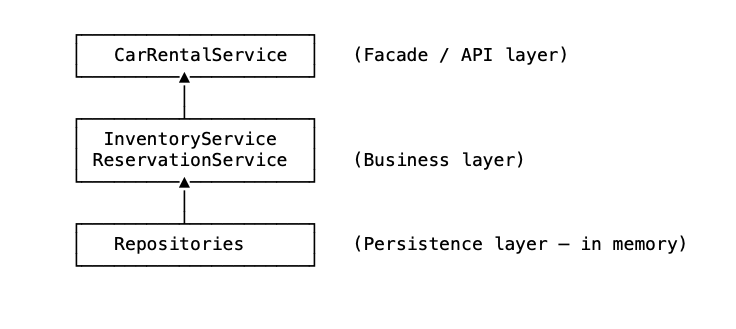
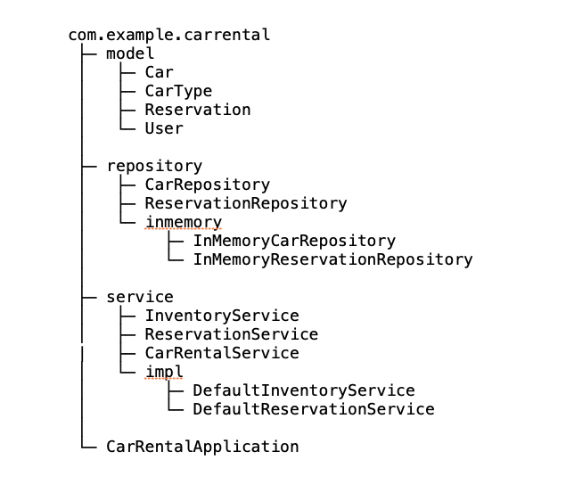

# Car Rental System – Java (OOP & SOLID Design)

This project is a simple, in-memory Car Rental System implemented in Java using object-oriented design and SOLID principles. It supports managing a car inventory, checking availability, and creating reservations for different types of cars.

The goal of this project is to demonstrate:
- Clean layered architecture
- Separation of concerns
- Testable business logic
- Unit testing using JUnit


# Features
- Add cars to inventory
- List cars by type
- Check available cars for a given period
- Create reservations
- Search reservations by user
- Search for reservations by car
- Filter active reservations
- In-memory repositories
- Fully covered with unit tests

# Supported Car Types
- SEDAN
- SUV
- VAN


# Architecture Overview

The design follows a layered and responsibility-driven architecture.




# Main Components

## Service Layer

### CarRentalService
Acts as the single entry point for clients. Responsibilities:
- add cars
- list available cars
- reserve cars

### InventoryService

- manages car inventory
- lists cars
- searches cars by id or type

### ReservationService
- performs availability checks
- creates reservations
- finds reservations by user or car
- filters active reservations


## Repository Layer

### CarRepository
- stores cars in memory

### ReservationRepository
- stores reservations in memory

## Model/Domain Layer
- Car
- CarType
- Reservation
- User

## Package Structure



## Design Principles Used

- Single Responsibility Principle
- Dependency Inversion (services depend on interfaces)
- Open/Closed Principle
- Separation of concerns

All dependencies are added via constructors.


## How to Checkout the Project
Clone repo from github:
```bash
git clone <repository-url>
```

## How to Import into Eclipse

- Open Eclipse
- File → Import
- Select Existing Maven Projects (if Maven is used) or Existing Projects into Workspace
- Browse to the cloned project directory
- Finish


## How to Run the Application

The project contains a small bootstrap class: **CarRentalApplication**
- Open: src/main/java/.../CarRentalApplication.java
- Right click → Run As → Java Application

This class wires repositories and services and runs a small demo scenario.


## How to Run Unit Tests in Eclipse
All unit tests are written using JUnit 5 (Jupiter) and are located under: **src/test/java**

### Run all tests
- Right-click on the project
- Run As → JUnit Test

### Run a single test
- Right click on a test class (for example): **DefaultReservationServiceTest**
- Run As → JUnit Test

## Test Coverage
The project includes unit tests for:
- CarRepository
- ReservationRepository
- InventoryService
- ReservationService
- CarRentalService

## Future Additions
- Move to Spring Boot: Services, Repositories, and Controllers autowired.
- DB Integration ( Replace In-Memory data) 
- REST APIs to expose the key functionality

